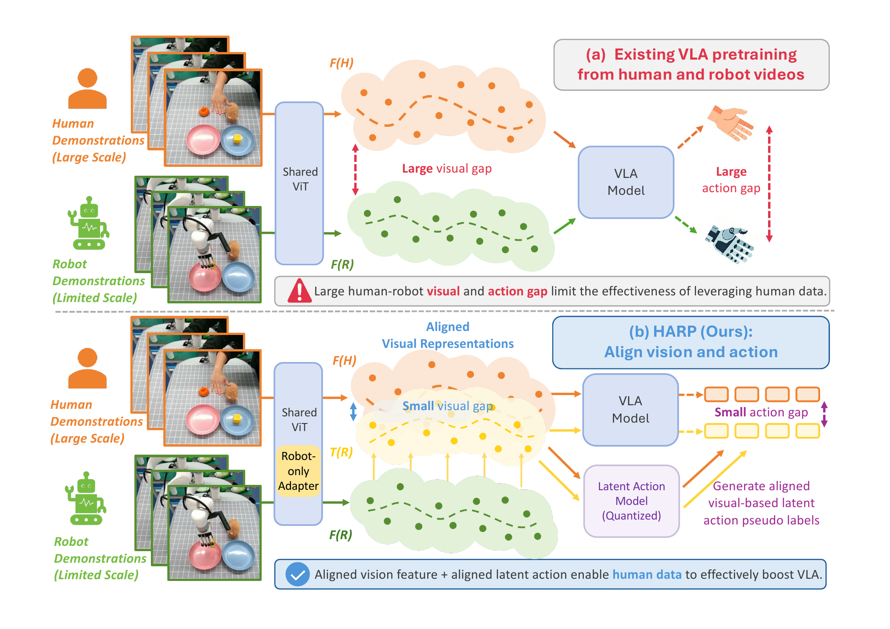

# HARP-VLA: Human-Robot Aligned Representation Learning for Vision-Language-Action Model

Official inference repository for **HARP-VLA**.

[Project website](https://puzhenyuan.github.io/HARP-VLA-website/) | [Paper](https://arxiv.org/abs/2605.31234) | [Checkpoint](https://huggingface.co/ypz21/HARP_VLA_calvin)

[](figure/MainFigure.pdf)

## Setup

Use Linux, Python 3.10, an NVIDIA GPU with CUDA 12.1 support, and EGL for headless rendering. Install Git, a C++ compiler, and the system OpenGL/EGL libraries before running the setup script. The checkpoint uses bfloat16; allow approximately 16 GB of disk space for the download. GPU memory requirements depend on the CUDA environment.

```bash
git clone https://github.com/PuzhenYuan/HARP-VLA.git
cd HARP-VLA
conda create -n harpvla python=3.10 -y
conda activate harpvla
bash examples/environment_setup.sh
```

The setup installs PyTorch 2.2.0, torchvision 0.17.0, and the OpenVLA-OFT Transformers fork at a fixed revision. It also installs a pinned CALVIN checkout under `third_party/calvin`. The custom Transformers fork is required for the policy's parallel action decoding. Flash Attention is not required by this inference configuration.

Obtain the CALVIN ABC→D evaluation environment from the [official CALVIN instructions](https://github.com/mees/calvin#dataset). Set `CALVIN_DATA_ROOT` to your benchmark directory containing `validation/`. Benchmark assets are downloaded separately.

## Download checkpoint

```bash
hf auth login  # Use an account with access to the private checkpoint.
python examples/download_checkpoint.py
```

Weights are saved to `checkpoints/calvin`. The merged model includes its vision adapters; the action head, proprioception projector and normalization statistics are provided alongside it.

## Evaluate

Run from the repository root with your activated environment:

```bash
export PYOPENGL_PLATFORM=egl
python -m experiments.robot.calvin.evaluate \
  --calvin_root "$CALVIN_DATA_ROOT" \
  --pretrained_checkpoint checkpoints/calvin \
  --center_crop True \
  --num_images_in_input 2 \
  --use_normalized True
```

The checkpoint argument also accepts `ypz21/HARP_VLA_calvin` directly. The default evaluation runs 1,000 five-task sequences with up to 360 environment steps per task and seed 7. Each inference call predicts a chunk of ten relative actions from the static camera, gripper camera and proprioception.

Results are written to a timestamped directory under `outputs/calvin`: `result.json` contains average successful sequence length, success rates for completing 1–5 tasks, and per-task counts; `success_rate.txt` records progress. Add `--num_sequences 1` for a short smoke run, or `--debug True` to save rollout GIFs. Use `--output_dir` to choose another output directory.

## Acknowledgements

We thank [OpenVLA-OFT](https://github.com/moojink/openvla-oft) and [UniVLA](https://github.com/OpenDriveLab/UniVLA) for their open-source implementations. Our evaluation uses [CALVIN](https://github.com/mees/calvin). See [NOTICE.txt](NOTICE.txt) for third-party attribution and licensing.

## Citation

```bibtex
@article{zhu2026harp,
  title={HARP-VLA: Human-Robot Aligned Representation Learning for Vision-Language-Action Model},
  author={Zhu, Xiang and Yuan, Puzhen and Liu, Yichen and Chen, Jianyu},
  journal={arXiv preprint arXiv:2605.31234},
  year={2026}
}
```
